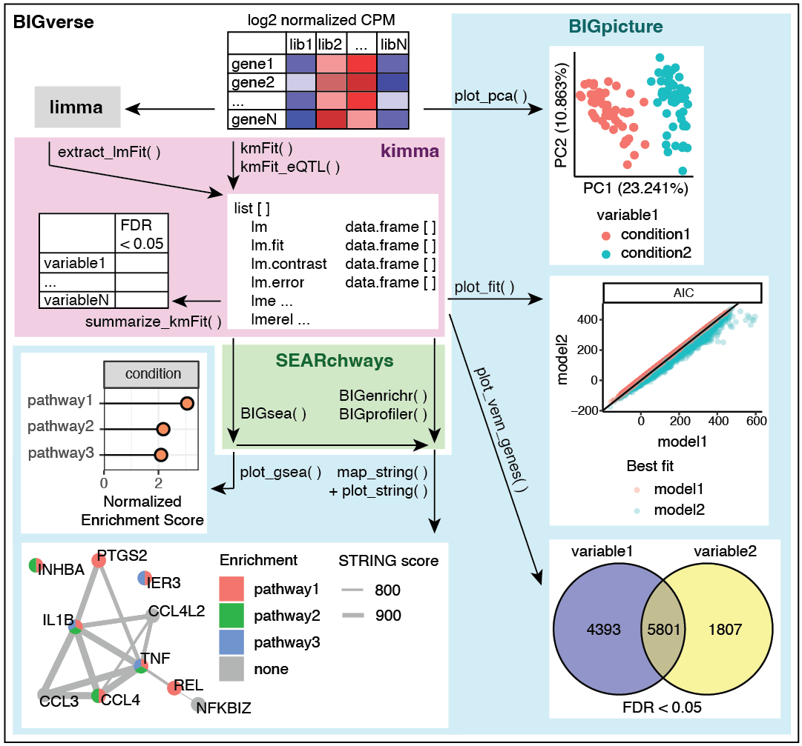

```{r include=FALSE}
knitr::opts_chunk$set(fig.height=3, fig.width = 8.5) 
```

# Overview

This package performs gene set enrichment analyses including functional/pathway enrichment and fold change GSEA. Checkout [BIGpicture](https://bigslu.github.io/vignettes/BIGpicture_vignette.html) for ways to plot these results.



# Setup
## Software and packages

This pipeline should be completed in `r base::R.Version()$version.string` or newer. Please also download the following packages.

```{r eval=FALSE}
# CRAN packages
install.packages(c("tidyverse"))

# Bioconductor packages
## These are dependencies for kimma that are beneficial to download separately
install.packages("BiocManager")
BiocManager::install(c("limma", "edgeR"))

# GitHub packages
install.packages("devtools")
devtools::install_github("BIGslu/kimma")
devtools::install_github("BIGslu/SEARchways")
```

And load them into your current R session.

```{r warning=FALSE}
library(tidyverse)
library(kimma)
library(SEARchways)
```

To ensure reproducibility with this document, set the random seed value.

```{r}
set.seed(651)
```

## Data background

Example data were obtained from media controls and human rhinovirus (HRV) infected human plasmacytoid dendritic cells. You can learn more about these data in

>Dill-McFarland KA, Schwartz JT, Zhao H, Shao B, Fulkerson PC, Altman MC, Gill MA. 2022. Eosinophil-mediated suppression and Anti-IL-5 enhancement of plasmacytoid dendritic cell interferon responses in asthma. J Allergy Clin Immunol. Epub ahead of print. doi: [10.1016/j.jaci.2022.03.025](https://doi.org/10.1016/j.jaci.2022.03.025). --- [GitHub](https://github.com/altman-lab/P259_pDC_public)

Specifically, this vignette uses bulk human RNA-seq processed from fastq to counts using [SEAsnake][pipeline1] and counts to voom using [edgeR/limma][pipeline2]. This results in voom-normalized, log2 counts per million (CPM) gene expression and associated sample and gene metadata. In total, 6 donors and 1000 random genes were selected for this vignette. Actual donor identifiers have been altered for privacy. 

## Load data

Gene fold change estimates.

```{r}
example.gene.list	 <- SEARchways::example.gene.list
str(example.gene.list)
```

Extract gene names only.

```{r}
example.gene.list2 <- list(
  "HRV1"=names(example.gene.list$HRV1),
  "HRV2"=names(SEARchways::example.gene.list$HRV2))
str(example.gene.list2)
```

Create data frame formats as well.

```{r}
example.gene.df <- data.frame(
  group = "HRV1",
  gene = names(example.gene.list$HRV1),
  logFC = example.gene.list$HRV1
)
head(example.gene.df)
```

```{r}
example.gene.df2 <- example.gene.df[,1:2]
head(example.gene.df2)
```

# Shared parameters

All `SEARchways` functions except `iterEnrich` can take either a named list (`gene_list`) or data frame (`gene_df`) as input (see examples above). Gene names can be HGNC/MGI symbols, ENSEMBL, or ENTREZ ID. Use `ID` to specify based on your data.

Additionally, all `SEARchways` functions can utilize the Broad [MSigDB](https://www.gsea-msigdb.org/gsea/msigdb/collections.jsp) gene set data base. Select the `species`, `collection`, and `subcollection` as needed. See function help pages for the lists of options.

Alternatively, you may also provide a custom data base such as WCGNA modules with `db`.

With the exception of data input, these parameters will not be demoed below since they work similarly across all functions.

# Functional / pathway / hypergeometric enrichment

Fisher's exact test of selected genes. 

## `flexEnrich`: Flexible enrichment

`flexEnrich` allows more customization than `BIGprofiler` but can run slower. By default, enrichment is performed against a protein-coding background and gene sets must be between 10 and 1E10 genes.

```{r}
flexEnrich(
  gene_list = example.gene.list2,
  ID = "ENSEMBL", species = "human", 
  collection = "H")
```

Use a data frame input.

```{r eval=FALSE}
flexEnrich(
  gene_df = example.gene.df2,
  ID = "ENSEMBL", species = "human", 
  collection = "H")
```

Change the background to a custom one (`custom_bg`) or include all genes by turning off `protein_coding`.

```{r eval=FALSE}
flexEnrich(
  gene_list = example.gene.list2,
  ID = "ENSEMBL", species = "human", 
  collection = "H",
  protein_coding = FALSE)
```

Restrict the gene sets included to those with at least 3 query genes and total size between 100 and 1000 genes.

```{r eval=FALSE}
flexEnrich(
  gene_list = example.gene.list2,
  ID = "ENSEMBL", species = "human", 
  collection = "H",
  minOverlap = 3,
  minGeneSetSize = 100,
  maxGeneSetSize = 1000)
```

Speed up computation by not saving the query genes found in each gene set.

```{r eval=FALSE}
flexEnrich(
  gene_list = example.gene.list2,
  ID = "ENSEMBL", species = "human", 
  collection = "H",
  print_genes = FALSE)
```

## `BIGprofiler`: Less flexible but faster enrichment

`BIGprofiler` performs the same enrichment as `flexEnrich` but with fewer options. It does not allow you to alter the background, always utilizing protein-coding only. Thus, when this background is desired, `BIGprofiler` may be utilized since it runs faster than `flexEnrich` on large queries.

```{r}
BIGprofiler(
  gene_list = example.gene.list2,
  ID = "ENSEMBL", species = "human", 
  collection = "H")
```

Restrict the gene sets included to those with total size between 100 and 1000 genes (similar to `flexEnrich`). 

```{r eval=FALSE}
BIGprofiler(
  gene_list = example.gene.list2,
  ID = "ENSEMBL", species = "human", 
  collection = "H",
  minGSSize = 100, maxGSSize = 1000)
```

## `iterEnrich`: Iterative enrichment

`iterEnrich` allows you to run enrichment on inputs other than genes. For example, if you have SNPs, each SNP may annotate to > 1 gene. Regular enrichment would result in over-representation of pathways associated these multiple annotation SNPs. Thus, `iterEnrich` subsamples gene lists to 1 annotation per feature (e.g. SNP, probe, etc) and runs enrichment across many subsamples to determine a more representative result.

Here, we create a fake gene annotation where each SNP is associated with 2 genes.

```{r}
example.gene.anno <- data.frame(
  SNP = c(paste0("SNP",1:50), paste0("SNP",1:50)),
  gene = sample(example.gene.list2[["HRV1"]], 
                replace = TRUE, size = 100)
)
head(example.gene.anno)
```

Run iterative enrichment. We reduce the number of iters and increase the processors to run quickly for this vignette.

```{r}
iter <- iterEnrich(
  anno_df = example.gene.anno,
  ID = "ENSEMBL", species = "human", 
  collection = "H",
  niter = 10, ncores = 6)

# Summary results across iters
iter$summary
# All individual iter results
head(iter$`k/K_iterations`)
head(iter$p_iterations)
```

Change the background to a custom one (`custom_bg`) or include all genes by turning off `protein_coding`.

```{r eval=FALSE}
iterEnrich(
  anno_df = example.gene.anno,
  ID = "ENSEMBL", species = "human", 
  collection = "H",
  niter = 10, ncores = 6,
  protein_coding = FALSE)
```

Restrict the gene sets included to those with at least 3 query genes and total size between 100 and 1000 genes.

```{r eval=FALSE}
iterEnrich(
  anno_df = example.gene.anno,
  ID = "ENSEMBL", species = "human", 
  collection = "H",
  niter = 10, ncores = 6,
  minOverlap = 3,
  minGeneSetSize = 100,
  maxGeneSetSize = 1000)
```

Speed up computation by not saving the query genes found in each gene set.

```{r eval=FALSE}
iterEnrich(
  anno_df = example.gene.anno,
  ID = "ENSEMBL", species = "human", 
  collection = "H",
  niter = 10, ncores = 6,
  print_genes = FALSE)
```

Other parameters

* Change the column names to match your annotation data with `anno_featCol` and `anno_annotationCol`
* Change the FDR method with `p_adjust`. See `p.adjust.methods` for options

# GSEA

Gene set enrichment analysis (GSEA) as described by [Broad](https://www.gsea-msigdb.org/gsea/index.jsp). This method utilizes the `fgsea` framework.

```{r}
BIGsea(
  gene_list = example.gene.list,
  ID = "ENSEMBL", species = "human", 
  collection = "C2", subcollection = "CP")
```

Use a data frame input.

```{r eval=FALSE}
BIGsea(
  gene_list = example.gene.df,
  ID = "ENSEMBL", species = "human", 
  collection = "C2", subcollection = "CP")
```

Restrict the gene sets included to those with total size between 100 and 1000 genes.

```{r eval=FALSE}
BIGsea(
  gene_list = example.gene.list,
  ID = "ENSEMBL", species = "human", 
  collection = "C2", subcollection = "CP",
  minGeneSetSize = 100, maxGeneSetSize = 1000)
```

Change the GSEA method. By default, `rand = "multi"`, which runs an adaptive multilevel splitting Monte Carlo approach. 

For very small sample groups, it is recommended to run "simple" randomization, which randomizes genes in gene sets only.

```{r eval=FALSE}
BIGsea(
  gene_list = example.gene.list,
  ID = "ENSEMBL", species = "human", 
  collection = "C2", subcollection = "CP",
  rand = "simple")
```

Alternatively, choose the "label" method to randomize samples in groups and calculate new fold changes for each randomization. This method runs `kimma` under the hood to determine fold changes. Thus, you have all the model flexibility of `kimma`, not just a simple A vs B fold change.

The "label" method requires `dat` and `rand_var` in order to calculate fold changes from the original expression data. You also must provide `kimma::kmFit` model parameters `model`, `run_`, `use_weights`, etc.

Finally, we strongly recommend only running on select gene sets with `pw` and reducing computational time with multiple `processors`. Here, we run only 3 permutations for speed as well.

```{r}
#Force original fold change list name to match example.voom$targets variable
example.gene.list.virus <- list(
  "virus" = example.gene.list$HRV1
)

gsea_label <- BIGsea(
  gene_list = example.gene.list.virus,
  ID = "ENSEMBL", species = "human", 
  collection = "C2", subcollection = "CP",
  rand = "label",
  #Data for fold change calculations
  dat = kimma::example.voom, 
  rand_var = "virus",
  #Parameters for kimma models
  model="~virus",
  run_lm=TRUE, use_weights=TRUE,
  #Recommend only running on select gene sets of interest
  pw = "REACTOME_TRANSPORT_OF_SMALL_MOLECULES",
  nperm = 3, processors = 3)
```

```{r}
#GSEA results
gsea_label$gsea
#Fold change estimates for each permutation
head(gsea_label$estimates)
```

Once you've run the "label" method once, you can reuse the fold change permutations for additional gene sets with `rand_est`.

```{r eval=FALSE}
gsea_label2 <- BIGsea(
  gene_list = example.gene.list.virus,
  ID = "ENSEMBL", species = "human", 
  collection = "C2", subcollection = "CP",
  rand = "label",
  #Data for fold change calculations
  dat = kimma::example.voom,
  rand_var = "virus",
  #Pre-made fold change results
  rand_est = gsea_label$estimates,
  #Recommend only running on select gene sets of interest
  pw = "REACTOME_POST_TRANSLATIONAL_PROTEIN_MODIFICATION",
  nperm = 3, processors = 3)
```

# R session

```{r}
sessionInfo()
```

[R]: https://cran.r-project.org/
[RStudio]: https://www.rstudio.com/products/rstudio/download/
[pipeline1]: https://bigslu.github.io/SEAsnake/vignette/SEAsnake_vignette.html
[pipeline2]: https://bigslu.github.io/tutorials/RNAseq/2.Hawn_RNAseq_counts.to.voom.html
